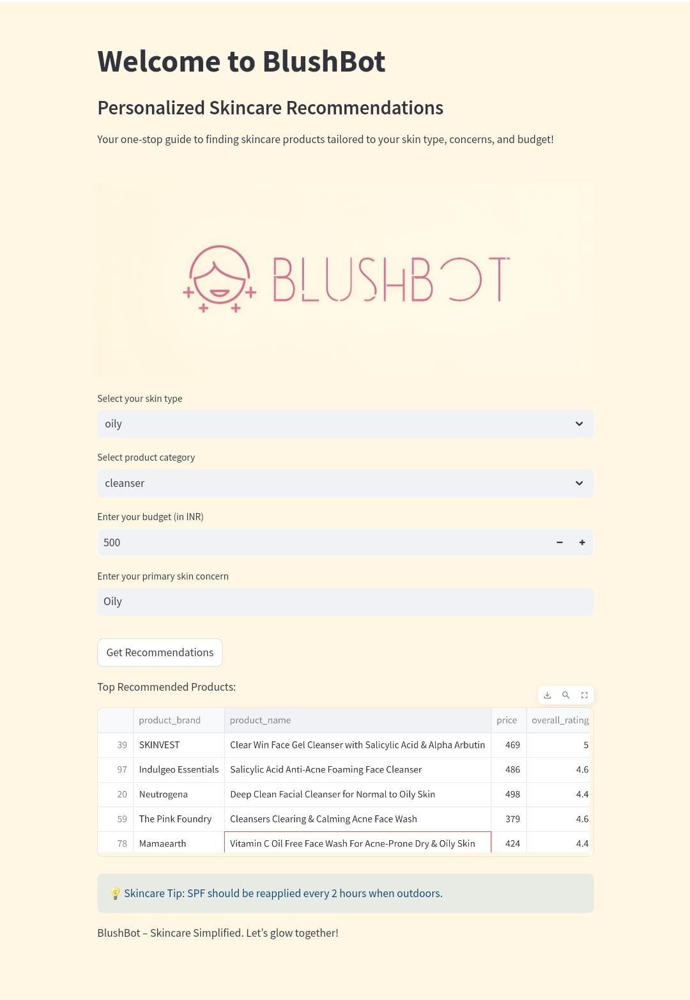
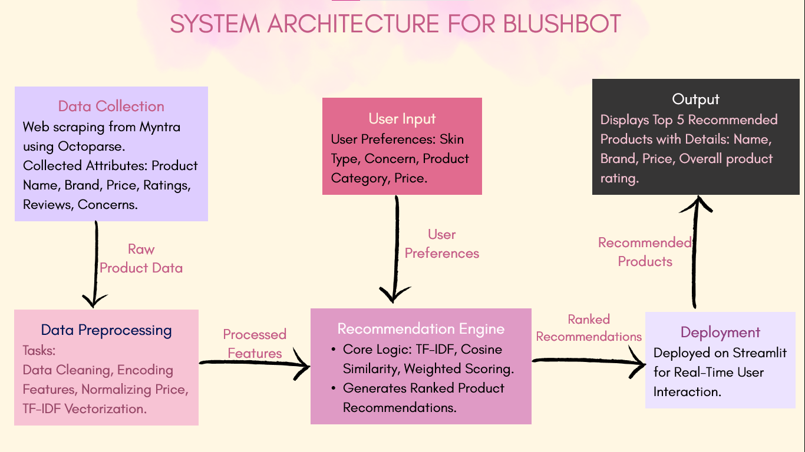

# BlushBot ✨  
*Your Personalized Skincare Recommendation System*  


---

## Overview  
Tired of browsing endless skincare products? 🤔 Worry no more! **BlushBot** is here to simplify your skincare journey. Built with **Streamlit**, it delivers tailored skincare recommendations based on your skin type, concerns, and budget. Whether you're tackling acne, seeking hydration, or looking for that perfect sunscreen, BlushBot has got you covered! 🌟  


---

## Features 🚀  
- **Personalized Recommendations**: Get the perfect product based on your inputs.  
- **Dynamic Filters**: Select skin type, primary concern, budget, and category.  
- **Random Skincare Facts**: A skincare fact pops up every time the screen refreshes!  
- **Interactive Interface**: Simple, clean, and user-friendly design.  

---

## How It Works 🛠️  
1. **Input Details**:  
   - Skin type: Oily, Dry, Sensitive, Combination, or Normal.
   - Product Category: Moisturizers, Sunscreens, Serums, etc.  
   - Concern: Acne, Pigmentation, Anti-aging, etc.  
   - Budget: Set your preferred price range.   

2. **Get Recommendations**:  
   - Results are fetched dynamically based on your inputs.  
   - Top 5 products are displayed with details like name, brand, price, and overall rating.  




---

## System Architecture 🧩  

The architecture consists of the following key modules:  
1. **User Input**: Collects user preferences through dropdowns, sliders, and buttons.
2. **Data Collection**: Web Scraping from Myntra using Octoparse. 
3. **Data Preprocessing**: Filters and processes product data using custom logic.  
4. **Recommendation Engine**: Suggests the best products based on user input using content-based filtering.  
5. **Deployment**: Displays the recommendations and interactive elements in Streamlit Cloud.
6. **Output**: Top 5 Recommendations are displayed as brand, name, price and overall product rating.



---

## Project Setup 🖥️  

### Hardware Requirements  
- **Processor**: Intel i3 or higher.  
- **RAM**: 4GB minimum (8GB recommended).  
- **Storage**: 500MB of free space.  

### Software Requirements  
- **Python**: Version 3.8 or above.  
- **Libraries**:  
  - `streamlit`  
  - `pandas`  
  - `numpy`
  - `sklearn`
- **Octoparse**: Used for web scraping product data from Myntra.  

---

## How to Run the Project 🏃  

1. Clone the repository:  
   ```bash
   git clone https://github.com/your-username/BlushBot.git
   cd BlushBot
2. Install the required dependencies:
   ```bash
   pip install -r requirements.txt
3. Run the Streamlit app:
   ```bash
    streamlit run app.py
4. Open the app in your browser and start glowing! 🌟

---


## Expected Outcomes 
- A highly interactive interface to simplify skincare product selection.
- Tailored recommendations based on Indian skincare brands and user preferences.
- Real-world utility for skincare enthusiasts and shoppers.


## Contributors 💡

- **Agamya David**
  [GitHub](https://github.com/agamyaaa14) | [LinkedIn](https://www.linkedin.com/in/agamya-david-07104725a/)

- **Thrishaa J**
  [GitHub](https://github.com/Thrishaa29) | [LinkedIn](https://www.linkedin.com/in/thrishaa-j-aa3023261/)

- **Neha Venkatesh**  
  [GitHub](https://github.com/neha6765venkatesh) | [LinkedIn](https://www.linkedin.com/in/neha-venkatesh-a841482b2/)

## References 📚
- Data scraped from Myntra using Octoparse.
- Built using Streamlit, Pandas, Sci-kit Learn and NumPy.
- Hosted on Streamlit Cloud.

## Future Enhancements 🔮
- Add multi-concern support for recommendations.
- Incorporate a machine learning model for advanced suggestions.
- Expand the database to include more skincare brands and products.
- Incorporate direct links to buy the products with images.
- Develop an app with user friendly interface to obtain accurate recommendations.
